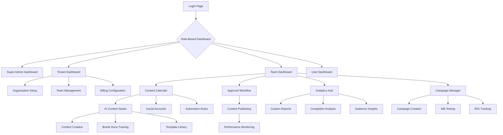

## 1. Product Overview

SocialPiloat.Ai is an enterprise-grade AI-powered social media management platform that enables businesses to automate, optimize, and scale their social media presence across multiple platforms. The platform combines advanced AI capabilities with comprehensive analytics, team collaboration, and multi-tenant architecture to deliver a complete social media solution for modern enterprises.

The platform solves critical pain points for businesses: time-consuming manual posting, inconsistent brand messaging, poor engagement rates, and lack of data-driven insights. SocialPiloat.Ai helps marketing teams, agencies, and enterprises manage hundreds of social accounts efficiently while maintaining quality and brand consistency.

Target market includes digital marketing agencies, enterprise marketing departments, social media managers, and content creators who need scalable, AI-enhanced social media management with enterprise-grade security and compliance.

## 2. Core Features

### 2.1 User Roles and Permissions

| Role | Registration Method | Core Permissions |
|------|---------------------|------------------|
| Super Admin | System initialization | Full system access, tenant management, platform configuration |
| Tenant Admin | Tenant creation/invitation | Tenant management, user management, billing, integrations |
| Organization Admin | Invitation/self-registration | Organization setup, team management, brand assets |
| Team Manager | Invitation/self-registration | Team oversight, approval workflows, reporting |
| Content Creator | Invitation/self-registration | Content creation, scheduling, basic analytics |
| Social Media Manager | Invitation/self-registration | Full content management, analytics, engagement |
| Analyst | Invitation/self-registration | Analytics access, reporting, data export |
| Guest User | Invitation with limited access | View-only access to specific dashboards |

### 2.2 Feature Modules

Our SocialPiloat.Ai platform consists of the following essential pages:

1. **Dashboard**: Real-time overview, key metrics, quick actions, activity feed
2. **Content Calendar**: Visual scheduling, drag-drop interface, multi-platform preview
3. **AI Content Studio**: AI writing assistant, content generation, brand voice training
4. **Social Accounts**: Platform integrations, account management, permission settings
5. **Analytics Hub**: Performance metrics, competitor analysis, custom reports
6. **Team Collaboration**: Workflow management, approval processes, team chat
7. **Campaign Manager**: Campaign creation, A/B testing, performance tracking
8. **Audience Insights**: Demographics, behavior analysis, segmentation
9. **Brand Assets**: Media library, templates, brand guidelines storage
10. **Automation Rules**: Trigger-based posting, auto-responses, smart scheduling
11. **Integrations Hub**: Third-party connections, API management, webhooks
12. **Billing & Subscription**: Plan management, usage tracking, payment processing
13. **User Management**: Team invites, role assignment, permission control
14. **Settings**: Platform configuration, security settings, notification preferences

### 2.3 Page Details

| Page Name | Module Name | Feature Description |
|-----------|-------------|---------------------|
| Dashboard | Metrics Overview | Display real-time follower growth, engagement rates, content performance across all connected platforms |
| Dashboard | Quick Actions | Provide shortcuts to create post, schedule content, view notifications, access recent campaigns |
| Dashboard | Activity Feed | Show chronological timeline of all platform activities, team actions, and system notifications |
| Content Calendar | Monthly View | Visual calendar with drag-drop functionality for scheduling posts across multiple platforms |
| Content Calendar | Weekly View | Detailed weekly planner with time slots, platform indicators, and content preview |
| Content Calendar | Bulk Operations | Enable mass scheduling, rescheduling, and deletion of multiple posts simultaneously |
| AI Content Studio | AI Writer | Generate platform-specific content using GPT models with brand voice training and tone adjustment |
| AI Content Studio | Content Templates | Provide industry-specific templates with customizable fields and AI-powered suggestions |
| AI Content Studio | Brand Voice Training | Analyze existing content to create consistent brand voice profiles for AI generation |
| Social Accounts | Platform Integration | Connect Facebook, Instagram, Twitter, LinkedIn, TikTok, YouTube, Pinterest with OAuth authentication |
| Social Accounts | Account Management | Organize accounts by client, brand, or campaign with folder structures and tagging systems |
| Social Accounts | Permission Control | Set granular permissions per account for team members with approval workflows |
| Analytics Hub | Performance Metrics | Track reach, impressions, engagement, click-through rates, conversion metrics with historical comparison |
| Analytics Hub | Competitor Analysis | Monitor competitor social media performance, content strategy, and engagement benchmarks |
| Analytics Hub | Custom Reports | Build personalized dashboards with custom KPIs, date ranges, and export capabilities |
| Team Collaboration | Workflow Management | Create custom approval workflows with multiple stages and automatic notifications |
| Team Collaboration | Team Chat | Real-time messaging system with file sharing, mentions, and project-specific channels |
| Team Collaboration | Task Assignment | Delegate content creation, review, and publishing tasks with deadlines and priority levels |
| Campaign Manager | Campaign Creation | Build multi-platform campaigns with unified messaging, scheduling, and budget allocation |
| Campaign Manager | A/B Testing | Test different content variations, posting times, and audience segments with statistical analysis |
| Campaign Manager | Performance Tracking | Monitor campaign ROI, engagement metrics, and goal completion rates in real-time |
| Audience Insights | Demographics | Analyze follower age, gender, location, language, and interests across platforms |
| Audience Insights | Behavior Analysis | Track optimal posting times, content preferences, engagement patterns, and growth trends |
| Audience Insights | Segmentation | Create custom audience segments based on engagement level, demographics, and custom criteria |
| Brand Assets | Media Library | Centralized storage for images, videos, GIFs with tagging, search, and version control |
| Brand Assets | Template Library | Pre-designed templates for different platforms, industries, and content types with customization |
| Brand Assets | Brand Guidelines | Store and manage brand colors, fonts, tone of voice, logo variations, and usage rules |
| Automation Rules | Smart Scheduling | Automatically post at optimal times based on audience activity and engagement history |
| Automation Rules | Auto-Responses | Set up automated replies to comments, messages, and mentions with customizable triggers |
| Automation Rules | Content Recycling | Automatically repurpose and reschedule high-performing content with variations |
| Integrations Hub | Third-party Apps | Connect with CRM systems, email marketing, analytics tools, and productivity apps |
| Integrations Hub | API Management | Provide REST API access with rate limiting, authentication, and documentation |
| Integrations Hub | Webhook Support | Configure real-time notifications for external systems with custom payload formatting |
| Billing & Subscription | Plan Management | Display current plan details, upgrade/downgrade options, and feature comparisons |
| Billing & Subscription | Usage Tracking | Monitor API calls, team member count, connected accounts, and storage usage |
| Billing & Subscription | Payment Processing | Handle secure payments with multiple gateways, invoicing, and subscription management |
| User Management | Team Invites | Send email invitations with role assignment, expiration dates, and bulk import capabilities |
| User Management | Role Assignment | Configure custom roles with specific permissions and hierarchical access control |
| User Management | Activity Logs | Track user actions, login history, permission changes, and security events |
| Settings | Platform Configuration | Customize platform behavior, integrations, security policies, and system preferences |
| Settings | Security Settings | Configure two-factor authentication, session management, IP restrictions, and audit logging |
| Settings | Notification Preferences | Set up email, SMS, and in-app notifications for different event types and urgency levels |

## 3. Core Process

### Super Admin Flow
Super Admin accesses the platform through secure login, manages tenant creation and configuration, monitors system health, configures global settings, and handles platform-wide integrations and security policies.

### Tenant Admin Flow
Tenant Admin registers organization, sets up billing information, invites team members, configures organization settings, manages social media integrations, and oversees all organizational activities and compliance requirements.

### Team Manager Flow
Team Manager creates content approval workflows, assigns tasks to team members, reviews and approves content, monitors team performance, generates reports, and ensures brand consistency across all social media activities.

### Content Creator Flow
Content Creator logs into the platform, accesses assigned tasks or creates new content, uses AI writing assistant for content generation, schedules posts across multiple platforms, monitors content performance, and collaborates with team members through built-in chat and approval systems.

### Social Media Manager Flow
Social Media Manager connects social media accounts, creates content calendars, schedules posts with optimal timing, monitors engagement and mentions, responds to comments and messages, analyzes performance metrics, and adjusts strategy based on AI-powered insights and recommendations.

### Analyst Flow
Analyst accesses comprehensive analytics dashboards, creates custom reports for stakeholders, tracks competitor performance, identifies trends and opportunities, measures campaign effectiveness, and provides data-driven recommendations for improving social media strategy and ROI.

## 4. User Interface Design

### 4.1 Design Style

**Primary Colors:**
- Primary: #6366F1 (Indigo) - Main brand color for CTAs and key elements
- Secondary: #8B5CF6 (Purple) - Accent color for highlights and secondary actions
- Success: #10B981 (Emerald) - Positive feedback and success states
- Warning: #F59E0B (Amber) - Warnings and important notifications
- Error: #EF4444 (Red) - Errors and destructive actions

**Button Styles:**
- Primary buttons: Rounded corners (8px), gradient backgrounds, subtle shadows, hover animations
- Secondary buttons: Outlined style with hover fill effects, consistent border radius
- Icon buttons: Circular design with hover states and tooltip support

**Typography:**
- Primary font: Inter for body text and UI elements
- Heading font: Inter Display for headlines and prominent text
- Font sizes: 14px base, scalable hierarchy from 12px to 48px
- Line heights: 1.5 for body text, 1.2 for headings

**Layout Style:**
- Card-based design with consistent spacing (8px grid system)
- Sidebar navigation with collapsible menu structure
- Responsive grid system supporting 12-column layouts
- Glassmorphism effects for overlays and modals

**Icon Style:**
- Heroicons for consistent iconography
- Custom animated icons for loading states and interactions
- Emoji support for content creation and reactions

### 4.2 Page Design Overview

| Page Name | Module Name | UI Elements |
|-----------|-------------|-------------|
| Dashboard | Metrics Cards | Glassmorphism cards with gradient backgrounds, animated number counters, sparkline charts with hover details |
| Dashboard | Activity Timeline | Vertical timeline with user avatars, action icons, timestamp badges, and inline media previews |
| Content Calendar | Calendar Grid | Interactive monthly calendar with color-coded posts, drag-drop handles, platform icons, and quick-edit modals |
| AI Content Studio | Text Editor | Rich text editor with AI toolbar, real-time suggestions panel, tone selector dropdown, and character counters |
| Analytics Hub | Chart Components | Interactive charts with zoom/pan controls, data point tooltips, comparison toggles, and export options |
| Team Collaboration | Kanban Board | Drag-drop task cards with user assignments, priority indicators, due date badges, and progress bars |
| Campaign Manager | Campaign Timeline | Horizontal timeline with milestone markers, budget progress bars, performance indicators, and quick actions |

### 4.3 Responsiveness

**Desktop-First Design:**
- Optimized for 1920x1080 and 1366x768 resolutions
- Maximum content width of 1440px with centered layout
- Multi-column layouts for dashboard and analytics views

**Mobile Adaptation:**
- Responsive breakpoints: 320px, 768px, 1024px, 1440px
- Touch-optimized interactions with swipe gestures
- Collapsible navigation and off-canvas menus
- Stacked card layouts for mobile views

**Touch Interaction:**
- 44px minimum touch targets for all interactive elements
- Swipe-to-delete and swipe-to-approve gestures
- Long-press for context menus and quick actions
- Pull-to-refresh for real-time data updates

**Cross-Platform Consistency:**
- Consistent experience across iOS, Android, and desktop web
- Platform-specific optimizations for native feel
- Offline capability with data synchronization
- Progressive Web App (PWA) support for mobile installation