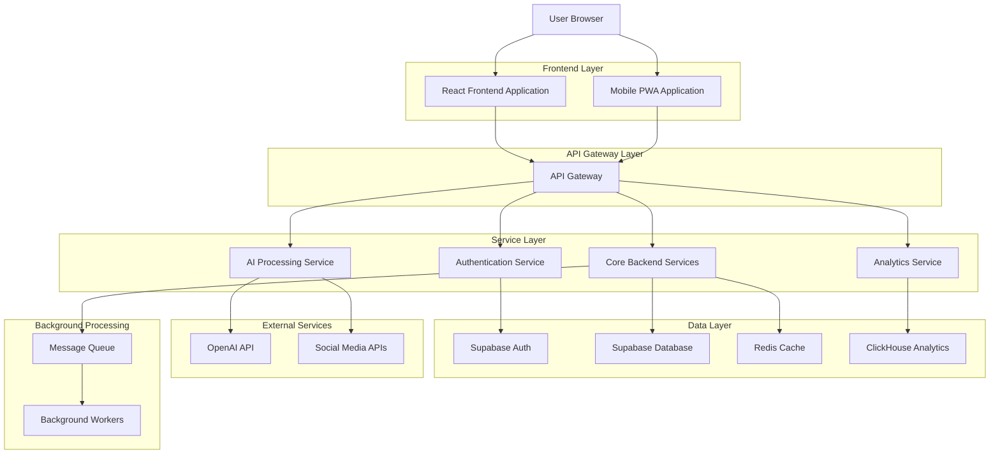
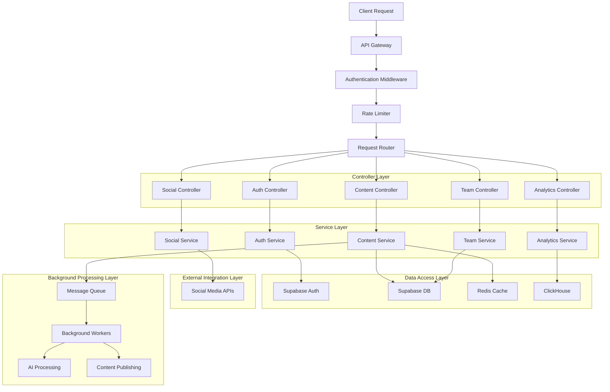
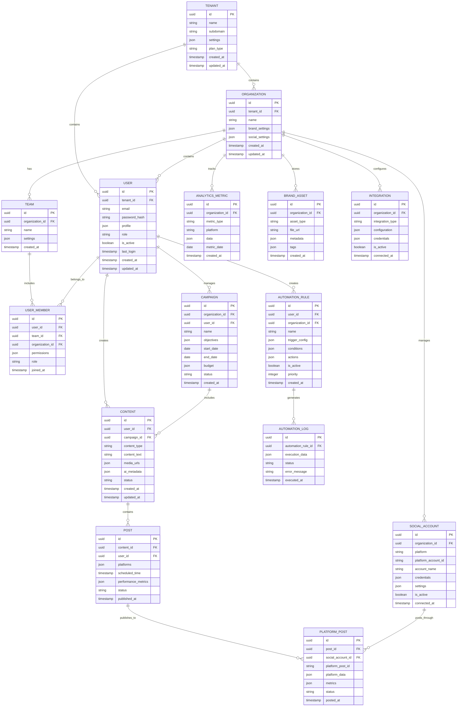

## 1. Architecture Design



## 2. Technology Description

**Frontend Stack:**
- React 18.2.0 with TypeScript 5.0
- Next.js 14 for SSR/SSG and optimal performance
- Tailwind CSS 3.4 for responsive styling
- Framer Motion for advanced animations
- React Query for server state management
- Zustand for client state management
- React Hook Form for form handling
- Socket.io-client for real-time updates

**Backend Stack:**
- Node.js 20 LTS with Express.js
- Supabase for authentication and database
- Redis 7 for caching and session management
- Bull Queue for background job processing
- Socket.io for real-time communication
- Winston for logging and monitoring

**AI/ML Services:**
- OpenAI GPT-4 for content generation
- OpenAI DALL-E for image generation
- Hugging Face Transformers for sentiment analysis
- Custom ML models for optimal posting times

**Analytics & Monitoring:**
- ClickHouse for real-time analytics
- Grafana for system monitoring
- Sentry for error tracking
- DataDog for application performance monitoring

**Infrastructure:**
- Docker containers with Kubernetes orchestration
- AWS/GCP cloud infrastructure
- CloudFlare CDN for global content delivery
- Terraform for infrastructure as code

## 3. Route Definitions

| Route | Purpose | Authentication | Permissions |
|-------|---------|---------------|-------------|
| / | Landing page with product information | Public | None |
| /auth/login | User authentication page | Public | None |
| /auth/register | User registration page | Public | None |
| /auth/reset-password | Password reset functionality | Public | None |
| /dashboard | Main dashboard with overview | Required | All authenticated users |
| /dashboard/analytics | Analytics and reporting | Required | Analyst+ roles |
| /content/calendar | Content scheduling calendar | Required | Content Creator+ |
| /content/ai-studio | AI content generation tools | Required | Content Creator+ |
| /content/templates | Content template library | Required | Content Creator+ |
| /social/accounts | Social media account management | Required | Social Media Manager+ |
| /social/engagement | Social media engagement tools | Required | Social Media Manager+ |
| /campaigns | Campaign management interface | Required | Team Manager+ |
| /campaigns/create | Campaign creation wizard | Required | Team Manager+ |
| /team/members | Team member management | Required | Organization Admin+ |
| /team/workflows | Approval workflow configuration | Required | Team Manager+ |
| /brand/assets | Brand asset library | Required | Content Creator+ |
| /brand/guidelines | Brand guidelines management | Required | Organization Admin+ |
| /automation/rules | Automation rule configuration | Required | Team Manager+ |
| /integrations | Third-party integrations | Required | Tenant Admin+ |
| /settings/profile | User profile settings | Required | All authenticated users |
| /settings/organization | Organization settings | Required | Organization Admin+ |
| /settings/billing | Billing and subscription management | Required | Tenant Admin+ |
| /api-docs | API documentation | Required | Developer roles |
| /admin/tenants | Tenant management (Super Admin) | Required | Super Admin only |
| /admin/system | System configuration (Super Admin) | Required | Super Admin only |

## 4. API Definitions

### 4.1 Authentication APIs

**User Login**
```
POST /api/auth/login
```

Request:
| Parameter | Type | Required | Description |
|-----------|------|----------|-------------|
| email | string | true | User email address |
| password | string | true | User password |
| rememberMe | boolean | false | Extended session duration |
| tenantId | string | false | Target tenant for multi-tenant login |

Response:
| Parameter | Type | Description |
|-----------|------|-------------|
| accessToken | string | JWT access token |
| refreshToken | string | JWT refresh token |
| user | object | User profile data |
| permissions | array | User permissions array |
| tenantInfo | object | Current tenant information |

**User Registration**
```
POST /api/auth/register
```

Request:
| Parameter | Type | Required | Description |
|-----------|------|----------|-------------|
| email | string | true | User email address |
| password | string | true | User password (min 8 chars) |
| name | string | true | Full name |
| organization | string | false | Organization name |
| role | string | false | Initial role assignment |
| tenantId | string | false | Invitation tenant ID |

### 4.2 Content Management APIs

**Create Content Post**
```
POST /api/content/posts
```

Request:
| Parameter | Type | Required | Description |
|-----------|------|----------|-------------|
| content | string | true | Post content text |
| platforms | array | true | Target platforms ['facebook', 'twitter', etc.] |
| scheduledTime | string | false | ISO timestamp for scheduled posting |
| mediaUrls | array | false | Array of media URLs |
| tags | array | false | Content tags for organization |
| campaignId | string | false | Associated campaign ID |
| aiGenerated | boolean | false | Flag for AI-generated content |

**Generate AI Content**
```
POST /api/ai/generate-content
```

Request:
| Parameter | Type | Required | Description |
|-----------|------|----------|-------------|
| prompt | string | true | Content generation prompt |
| platform | string | true | Target platform |
| tone | string | false | Brand tone ('professional', 'casual', etc.) |
| length | string | false | Content length ('short', 'medium', 'long') |
| includeHashtags | boolean | false | Auto-generate relevant hashtags |
| brandVoice | string | false | Brand voice profile ID |

### 4.3 Analytics APIs

**Get Analytics Data**
```
GET /api/analytics/metrics
```

Query Parameters:
| Parameter | Type | Required | Description |
|-----------|------|----------|-------------|
| startDate | string | true | Start date (ISO format) |
| endDate | string | true | End date (ISO format) |
| platforms | array | false | Filter by platforms |
| metrics | array | false | Specific metrics to include |
| aggregation | string | false | Aggregation level ('day', 'week', 'month') |
| compareTo | object | false | Comparison period settings |

**Get Competitor Analysis**
```
GET /api/analytics/competitors/{competitorId}
```

### 4.4 Social Media APIs

**Connect Social Account**
```
POST /api/social/accounts/connect
```

Request:
| Parameter | Type | Required | Description |
|-----------|------|----------|-------------|
| platform | string | true | Social platform ('facebook', 'instagram', etc.) |
| accessToken | string | true | Platform access token |
| accountId | string | true | Platform account ID |
| accountName | string | true | Display name for the account |
| permissions | array | false | Requested permissions array |

**Publish Content**
```
POST /api/social/publish/{accountId}
```

**Get Engagement Data**
```
GET /api/social/engagement/{accountId}
```

### 4.5 Team Management APIs

**Invite Team Member**
```
POST /api/team/invite
```

Request:
| Parameter | Type | Required | Description |
|-----------|------|----------|-------------|
| email | string | true | Invite recipient email |
| role | string | true | Assigned role |
| permissions | array | true | Specific permissions array |
| message | string | false | Custom invitation message |
| expiresIn | number | false | Invitation expiration in days |

**Update User Role**
```
PUT /api/team/members/{userId}/role
```

### 4.6 Automation APIs

**Create Automation Rule**
```
POST /api/automation/rules
```

Request:
| Parameter | Type | Required | Description |
|-----------|------|----------|-------------|
| name | string | true | Rule name |
| trigger | object | true | Trigger configuration |
| conditions | array | true | Rule conditions array |
| actions | array | true | Actions to execute |
| enabled | boolean | true | Rule active status |
| priority | number | false | Rule execution priority |

## 5. Server Architecture Diagram



## 6. Data Model

### 6.1 Database Schema Design



### 6.2 Data Definition Language (DDL)

**Tenant Table**
```sql
CREATE TABLE tenants (
    id UUID PRIMARY KEY DEFAULT gen_random_uuid(),
    name VARCHAR(255) NOT NULL,
    subdomain VARCHAR(100) UNIQUE NOT NULL,
    settings JSONB DEFAULT '{}',
    plan_type VARCHAR(50) DEFAULT 'free',
    is_active BOOLEAN DEFAULT true,
    created_at TIMESTAMP WITH TIME ZONE DEFAULT NOW(),
    updated_at TIMESTAMP WITH TIME ZONE DEFAULT NOW()
);

CREATE INDEX idx_tenants_subdomain ON tenants(subdomain);
CREATE INDEX idx_tenants_plan_type ON tenants(plan_type);
```

**Users Table**
```sql
CREATE TABLE users (
    id UUID PRIMARY KEY DEFAULT gen_random_uuid(),
    tenant_id UUID REFERENCES tenants(id) ON DELETE CASCADE,
    email VARCHAR(255) UNIQUE NOT NULL,
    password_hash VARCHAR(255) NOT NULL,
    profile JSONB DEFAULT '{}',
    role VARCHAR(50) DEFAULT 'user',
    is_active BOOLEAN DEFAULT true,
    last_login TIMESTAMP WITH TIME ZONE,
    created_at TIMESTAMP WITH TIME ZONE DEFAULT NOW(),
    updated_at TIMESTAMP WITH TIME ZONE DEFAULT NOW()
);

CREATE INDEX idx_users_tenant_id ON users(tenant_id);
CREATE INDEX idx_users_email ON users(email);
CREATE INDEX idx_users_role ON users(role);
```

**Organizations Table**
```sql
CREATE TABLE organizations (
    id UUID PRIMARY KEY DEFAULT gen_random_uuid(),
    tenant_id UUID REFERENCES tenants(id) ON DELETE CASCADE,
    name VARCHAR(255) NOT NULL,
    brand_settings JSONB DEFAULT '{}',
    social_settings JSONB DEFAULT '{}',
    created_at TIMESTAMP WITH TIME ZONE DEFAULT NOW(),
    updated_at TIMESTAMP WITH TIME ZONE DEFAULT NOW()
);

CREATE INDEX idx_organizations_tenant_id ON organizations(tenant_id);
```

**Social Accounts Table**
```sql
CREATE TABLE social_accounts (
    id UUID PRIMARY KEY DEFAULT gen_random_uuid(),
    organization_id UUID REFERENCES organizations(id) ON DELETE CASCADE,
    platform VARCHAR(50) NOT NULL,
    platform_account_id VARCHAR(255) NOT NULL,
    account_name VARCHAR(255) NOT NULL,
    credentials JSONB NOT NULL,
    settings JSONB DEFAULT '{}',
    is_active BOOLEAN DEFAULT true,
    connected_at TIMESTAMP WITH TIME ZONE DEFAULT NOW(),
    created_at TIMESTAMP WITH TIME ZONE DEFAULT NOW(),
    updated_at TIMESTAMP WITH TIME ZONE DEFAULT NOW(),
    UNIQUE(organization_id, platform, platform_account_id)
);

CREATE INDEX idx_social_accounts_organization_id ON social_accounts(organization_id);
CREATE INDEX idx_social_accounts_platform ON social_accounts(platform);
```

**Content Table**
```sql
CREATE TABLE content (
    id UUID PRIMARY KEY DEFAULT gen_random_uuid(),
    user_id UUID REFERENCES users(id) ON DELETE CASCADE,
    campaign_id UUID REFERENCES campaigns(id) ON DELETE SET NULL,
    content_type VARCHAR(50) DEFAULT 'post',
    content_text TEXT,
    media_urls JSONB DEFAULT '[]',
    ai_metadata JSONB DEFAULT '{}',
    status VARCHAR(50) DEFAULT 'draft',
    created_at TIMESTAMP WITH TIME ZONE DEFAULT NOW(),
    updated_at TIMESTAMP WITH TIME ZONE DEFAULT NOW()
);

CREATE INDEX idx_content_user_id ON content(user_id);
CREATE INDEX idx_content_campaign_id ON content(campaign_id);
CREATE INDEX idx_content_status ON content(status);
```

**Posts Table**
```sql
CREATE TABLE posts (
    id UUID PRIMARY KEY DEFAULT gen_random_uuid(),
    content_id UUID REFERENCES content(id) ON DELETE CASCADE,
    user_id UUID REFERENCES users(id) ON DELETE CASCADE,
    platforms JSONB NOT NULL,
    scheduled_time TIMESTAMP WITH TIME ZONE,
    performance_metrics JSONB DEFAULT '{}',
    status VARCHAR(50) DEFAULT 'scheduled',
    published_at TIMESTAMP WITH TIME ZONE,
    created_at TIMESTAMP WITH TIME ZONE DEFAULT NOW(),
    updated_at TIMESTAMP WITH TIME ZONE DEFAULT NOW()
);

CREATE INDEX idx_posts_content_id ON posts(content_id);
CREATE INDEX idx_posts_user_id ON posts(user_id);
CREATE INDEX idx_posts_scheduled_time ON posts(scheduled_time);
CREATE INDEX idx_posts_status ON posts(status);
```

**Analytics Metrics Table**
```sql
CREATE TABLE analytics_metrics (
    id UUID PRIMARY KEY DEFAULT gen_random_uuid(),
    organization_id UUID REFERENCES organizations(id) ON DELETE CASCADE,
    metric_type VARCHAR(100) NOT NULL,
    platform VARCHAR(50),
    data JSONB NOT NULL,
    metric_date DATE NOT NULL,
    created_at TIMESTAMP WITH TIME ZONE DEFAULT NOW()
);

CREATE INDEX idx_analytics_organization_id ON analytics_metrics(organization_id);
CREATE INDEX idx_analytics_metric_type ON analytics_metrics(metric_type);
CREATE INDEX idx_analytics_metric_date ON analytics_metrics(metric_date);
```

**Automation Rules Table**
```sql
CREATE TABLE automation_rules (
    id UUID PRIMARY KEY DEFAULT gen_random_uuid(),
    user_id UUID REFERENCES users(id) ON DELETE CASCADE,
    organization_id UUID REFERENCES organizations(id) ON DELETE CASCADE,
    name VARCHAR(255) NOT NULL,
    trigger_config JSONB NOT NULL,
    conditions JSONB NOT NULL,
    actions JSONB NOT NULL,
    is_active BOOLEAN DEFAULT true,
    priority INTEGER DEFAULT 0,
    created_at TIMESTAMP WITH TIME ZONE DEFAULT NOW(),
    updated_at TIMESTAMP WITH TIME ZONE DEFAULT NOW()
);

CREATE INDEX idx_automation_user_id ON automation_rules(user_id);
CREATE INDEX idx_automation_organization_id ON automation_rules(organization_id);
CREATE INDEX idx_automation_active ON automation_rules(is_active);
```

**Grant Permissions for Supabase**
```sql
-- Grant basic read access to anonymous users
GRANT SELECT ON tenants TO anon;
GRANT SELECT ON organizations TO anon;

-- Grant full access to authenticated users
GRANT ALL PRIVILEGES ON users TO authenticated;
GRANT ALL PRIVILEGES ON organizations TO authenticated;
GRANT ALL PRIVILEGES ON social_accounts TO authenticated;
GRANT ALL PRIVILEGES ON content TO authenticated;
GRANT ALL PRIVILEGES ON posts TO authenticated;
GRANT ALL PRIVILEGES ON campaigns TO authenticated;
GRANT ALL PRIVILEGES ON analytics_metrics TO authenticated;
GRANT ALL PRIVILEGES ON automation_rules TO authenticated;
GRANT ALL PRIVILEGES ON brand_assets TO authenticated;
GRANT ALL PRIVILEGES ON integrations TO authenticated;
```

## 7. Security Model

### 7.1 Authentication & Authorization
- JWT-based authentication with refresh token rotation
- Multi-factor authentication (MFA) support
- Role-based access control (RBAC) with hierarchical permissions
- API key management for third-party integrations
- Session management with automatic timeout

### 7.2 Data Security
- End-to-end encryption for sensitive data
- Field-level encryption for API credentials
- Data anonymization for analytics
- GDPR compliance with data deletion capabilities
- SOC 2 Type II compliance standards

### 7.3 API Security
- Rate limiting per user and IP address
- CORS configuration for allowed origins
- Input validation and sanitization
- SQL injection prevention
- XSS protection headers

### 7.4 Infrastructure Security
- SSL/TLS encryption for all communications
- Network segmentation and VPC isolation
- Regular security audits and penetration testing
- Automated vulnerability scanning
- Incident response procedures

## 8. Integration Specifications

### 8.1 Social Media APIs
- Facebook Graph API v18.0 with Instagram Basic Display
- Twitter API v2 with elevated access
- LinkedIn API with marketing developer platform
- TikTok Business API for content publishing
- YouTube Data API v3 for video management
- Pinterest API v5 for pin creation and management

### 8.2 Third-Party Integrations
- Slack/Teams for notifications and collaboration
- Google Analytics for web traffic analysis
- Salesforce/HubSpot for CRM synchronization
- Zapier/Make for workflow automation
- Canva for design template integration
- Dropbox/Google Drive for asset storage

### 8.3 Webhook Support
- Real-time event notifications
- Custom payload formatting
- Retry mechanisms with exponential backoff
- Webhook signature verification
- Event filtering and routing

## 9. Performance & Scalability

### 9.1 Performance Optimization
- Database indexing for fast queries
- Redis caching for frequently accessed data
- CDN integration for static assets
- Image optimization and lazy loading
- Database connection pooling

### 9.2 Scalability Architecture
- Horizontal scaling with load balancing
- Microservices architecture for independent scaling
- Message queue for asynchronous processing
- Database sharding for large datasets
- Auto-scaling based on traffic patterns

### 9.3 Monitoring & Alerting
- Application Performance Monitoring (APM)
- Real-time error tracking and reporting
- System health checks and uptime monitoring
- Custom metrics and business KPIs
- Automated alerting for critical issues

## 10. Deployment & DevOps

### 10.1 Container Architecture
- Docker containers for all services
- Kubernetes for orchestration and management
- Helm charts for deployment configuration
- Service mesh for inter-service communication
- Container registry for image management

### 10.2 CI/CD Pipeline
- Git-based version control with feature branching
- Automated testing with unit, integration, and E2E tests
- Code quality checks with linting and security scanning
- Automated deployment to staging and production
- Rollback capabilities for failed deployments

### 10.3 Environment Management
- Development, staging, and production environments
- Environment-specific configuration management
- Secrets management with encryption
- Database migration automation
- Blue-green deployment